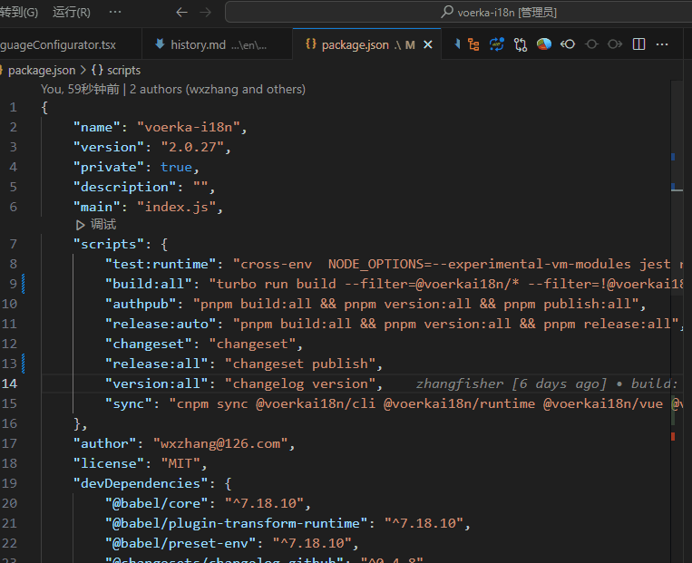
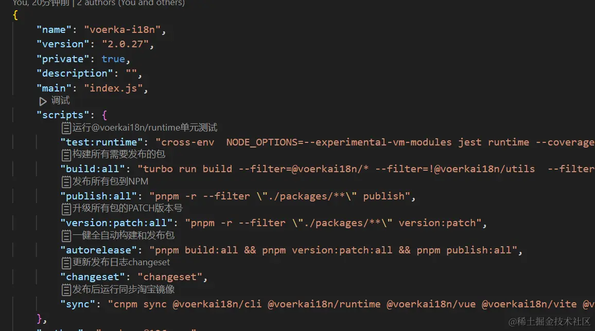

# json-comments

[中文](./README_CN.md) | [English](./README.md) 

Add custom comments to any JSON file with ease.





## Install

Open `VSCode` extension panel, search for `JsonComments`, then install it.

[Link](https://marketplace.visualstudio.com/items?itemName=wxzhang.json-comments&ssr=false#review-details)

## Usage

- **Add comments**

  Open any JSON file in your current workspace, hover over any key, and click on `+ Add Comment` in the hover tooltip. You can then input your comment, and it will be added. The comments will be displayed above the commented keys in the form of `CodeLens`.

- **Remove comments**

  Simply click on the comment content and select `Remove Comment` to delete it.

- **Clear all comments**

  Press <kbd>Ctrl+Shift+P</kbd>, type `Clear All Comments`, and select it to remove all comments in the current document.

## Questions

- **Where are the comment contents saved?**

  By default, the comment contents are saved in the `json-comments` section of the `package.json` file in your current workspace. If you want to modify the save location, you can do so in the workspace configuration.

- **How can I change the comment save location?**

  Modify the `commentsFile` and `entryKey` in the workspace configuration for `json-comments`. For example:
 
  ```js
  // Save comments in a file named comments.json in the current workspace
  "json-comments": {    
    "commentsFile": "comments.json",
    "entryKey": ""          
  }
  ```

- **Will the comments modify the original JSON file?**

  No, all comments are by default saved in the `json-comments` section of the `package.json` file. The original JSON file remains unchanged.

- **Will the comments be lost after committing to Git?**
  
  No, as long as you include the file where the comments are saved in the commit, the comments will not be lost.

- **Can other team members see the comments?**

  Yes, other team members can see the comments by installing the JsonComments plugin.

- **Will the comments be lost when the JSON file is edited?**

  The comments will not be lost as long as the JSON path of the commented key remains unchanged. JsonComments saves the comments based on the JSON path as the key.

- **Will moving the JSON file cause the comments to be lost?**

  No, JsonComments will automatically update the comment information when moving or renaming the JSON file to ensure that the comment information is not lost.
  However, if you move or rename the file outside the VSCode environment, the associated comment information will be lost. In this case, you can manually modify the path in the `json-comments` section of the `package.json` file.

- **Why is `tsconfig.json` not supported??**

  `tsconfig. json` is marked as JSONC format. Although the `JSONC` format also has a `JSON` extension, but it is not a standard `JSON` format and cannot be parsed use `JSON.parse`. so, it already supports comments and does not require 'jsonComment'.
  


## Recommendations

[VoerkaI18n](https://github.com/zhangfisher/voerka-i18n) - Internationalization solution for 'Javascript/Typescript/Vue/React/Solidjs/SvelteJs/ReactNative'


